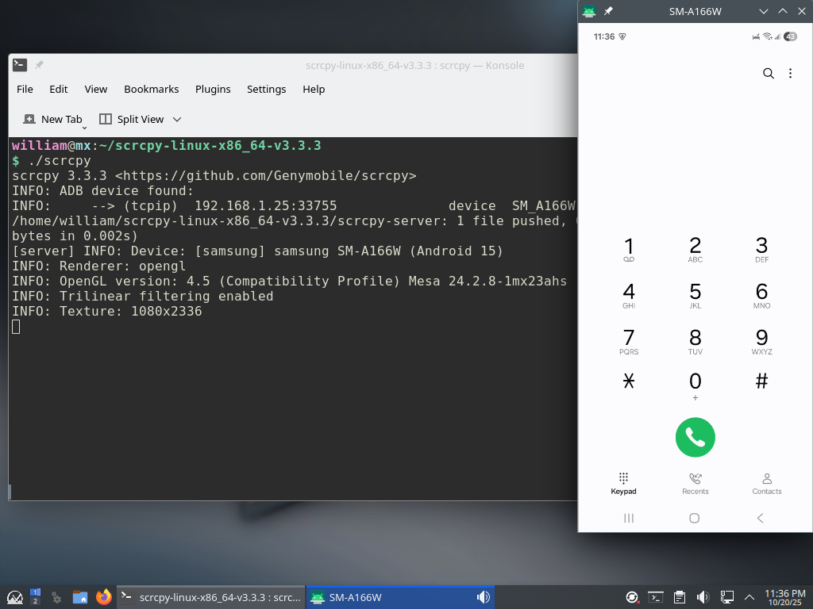

## Android related stuffs

- **ADB** (Android Debug Bridge)
  - main site --- [https://developer.android.com/tools/adb](https://developer.android.com/tools/adb)
  - standalone version --- [https://developer.android.com/studio/releases/platform-tools](https://developer.android.com/studio/releases/platform-tools)

- **scrcpy** (Android Screen Mirroring Tool) which runs on top of ADB.
  - website --- [scrcpy.org](scrcpy.org)
  - repository --- [https://github.com/Genymobile/scrcpy/ ](https://github.com/Genymobile/scrcpy/)

You can run ADB over USB or WiFi.  WiFi is preferred, because 
  - it frees up USB port for charging,
  - no messy cables, and
  - you can do debugging from VM.

---

### 1.&emsp;Prepare phone for WiFi debug.

1. Enable `Developer options` (normally hidden), by tapping `Build number` 7 times.
2. Disable `Auto Blocker`.
3. Enable `Wireless debugging`.

### 2.&emsp;Pair phone and desktop.

On `Wireless debugging` section, you'll see
  - Device name
  - IP address & Port --- eg. 192.168.1.25:22222

1. Tap `Pair device with pairing code`, and you get a popup with
   - Wi-Fi pairing code --- eg. 666777
   - IP address & Port --- eg. 192.168.1.25:44444

2. `adb pair 192.168.1.25:44444 666777`

3. `adb connect 192.168.1.25:22222`
   - Use the phone port, not the pairing port just used.
   - Phone should say "Currently connected".

4. `adb devices`
   - The phone IP:port should be listed

5. `scrcpy`
   - You can type/click on desktop, and the phone will act on those inputs.
   - Screenshot for Samsung Galaxy A16 is 


### 3.&emsp;Send keyboard/mouse input to phone via ADB.

You can send keyboard/mouse input to the phone through ADB, instead of
manually typing and clicking.

1. On the front page, with Google Search in the centre,
   ```
   adb shell input tap 540 1120              --- tap Google Search
   adb shell input text "distrowatch.com"    --- type "distrowatch.com"
   adb shell input keyevent KEYCODE_ENTER    --- press <Enter>
   ```

3. There are other keycodes:
   - 3 buttons at the bottom (recent apps, home, back)
     ```
     KEYCODE_RECENT_APPS
     KEYCODE_HOME
     KEYCODE_BACK
     ```

   - phone related
     ```
     KEYCODE_0 ... KEYCODE_9
     KEYCODE_STAR
     KEYCODE_POUND
     KEYCODE_CALL
     KEYCODE_ENDCALL
     ```

   - text entry
     ```
     KEYCODE_A ... KEYCODE_Z
     KEYCODE_AT
     KEYCODE_PERIOD
     KEYCODE_PLUS
     KEYCODE_MINUS
     KEYCODE_SLASH
     KEYCODE_SPACE
     KEYCODE_DEL
     KEYCODE_ENTER
     KEYCODE_TAB
     ```

### 4.&emsp;Determine X and Y positions.

1. Enable `Pointer location`.
   - X,Y positions of screen touch will be printed at the top of screen.

2. `adb shell getevent -l`
   - `ABS_MT_POSITION_X` --- x position in hex
   - `ABS_MT_POSITION_Y` --- y position in hex

